# How to Extract `.TRC` files from MICROMED's BrainQuick program

An easy to follow guide for a convoluted process.

## What are MICROMED's `.TRC` files?

`.TRC` is a specialized proprietary file format that stores neurophysiological data. It includes raw EEG recordings and the events or annotations corresponding to those recordings. These files can usually only be read by MICROMED software, such as BrainQuick. However, using python libraries, such as `seeg-parser` (which is based on `wonambi`), it is possible to decode these files and save them in universal formats, such as `.EDF`.

## How to locate a `.TRC` file step-by-step

The hard part of extracting a `.TRC` file is knowing its location. To obtain this information, we will use queues given by the BrainQuick software. Once the location of the file is known, it will be trivial to copy the file into a hard drive, and then decode it using `seeg-parser` to put it into a standard Brain Imaging Data Structre.

### Step 1: Open BrainQuick and search for the patient's session

Press F2 or click the Change Patient icon in the top left to search for a patient using its ID. This will allow you to visualize all recordings from that patient's session.

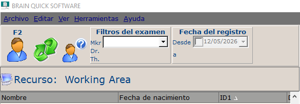

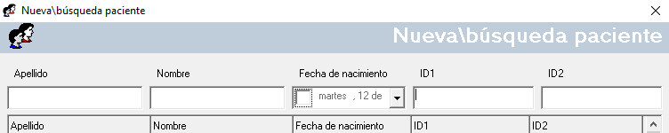

### Step 2: Pick a recording

Look through the recordings in the Patient pannel (in the middle of the screen). Guide yourself with the comments attached to each recording to choose the recording (or recordings) that you would like to extract.

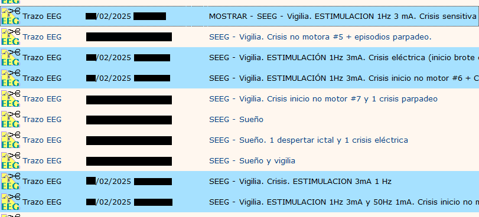

### Step 3: Determine the storage location of the EEG trace

In the Exam pannel (in the right of the screen), you will see a series of files associated to the recording that you select in the Patient pannel. One of the files should be an EEG trace.

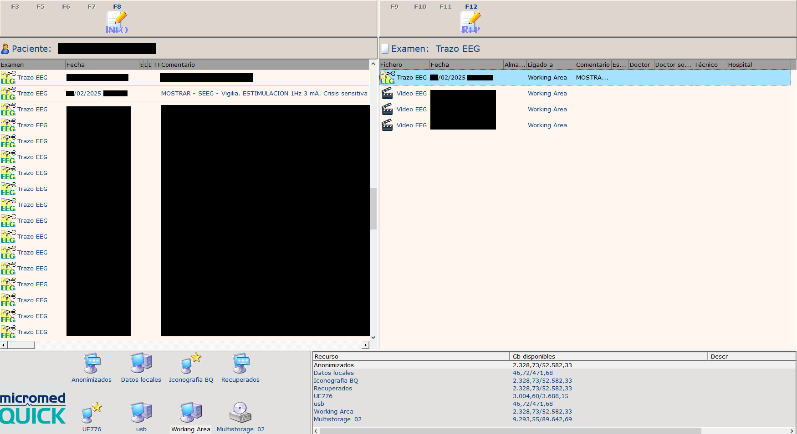

Take a look at the properties in that Exam pannel. You should either see a Storage Number, or an Association to the Working area. The next steps differ depending on whether your file is in the storage or in the working area.

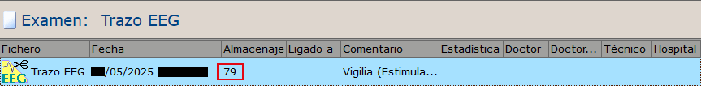

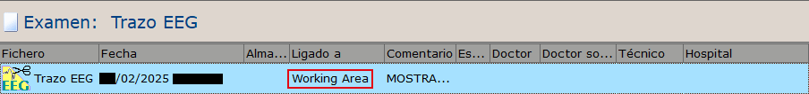

### Step 4: Determine the internal patient ID and EEG ID

Right-click the EEG trace in the Exam pannel and click Properties.

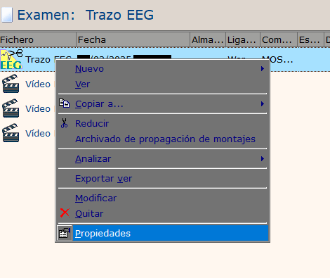

Inside the Properties pannel, go to File and check its Position. The directory tells you the internal patient ID and EEG ID used by the program to identify that specific recording. These IDs are not displayed to the user in any other way and do not necessarily correspond to the hospital's patient ID.

In the case of the patient in the Working Area, we got the following Patient ID:

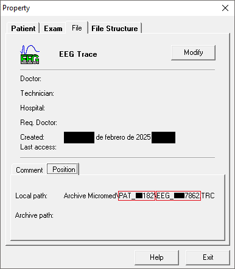

In the case of the patient in storage 79, we got the following Patient ID:

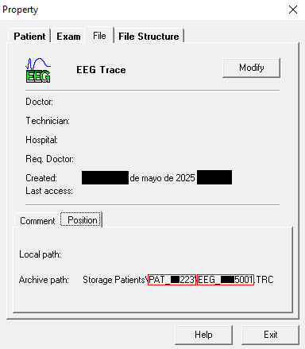

### Step 5: Open the server where the files are stored

For this next step, you will need the password or administration permissions to open the directory where the patient's data is stored. In our case, the directory can be accessed by creating a Direct Access link to the following IP address:

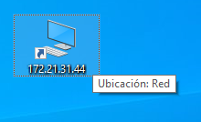

### Step 6: Go to the patient's folder

The location of the patient's folder depends on whether your EEG trace is in the Working Area or in a numbered storage.

If your patient is in the Working Area, click the `SystemPLUS WorkingArea` directory and enter the `Archive Micromed` folder.

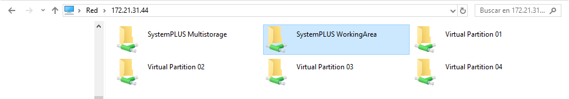
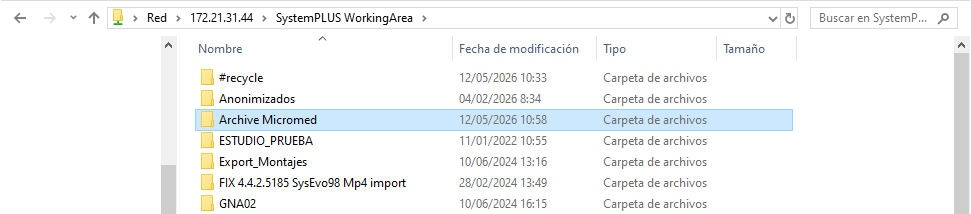

Once there, you can search the patient's folder with the previously obtained internal patient ID. In our case, this ID was `PAT_XX182`.

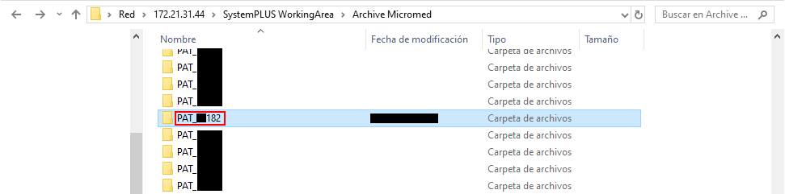

In the case where your patient is in a numbered storage, click the `SystemPLUS Multistorage` directory. Once there, you will have to choose between several folders named `Multistorage_XX`, where `XX` stands for a number. There is no way to know for sure in which folder you should look, but a higher storage number typically will correspond to a higher multistorage number. For now, pick one heuristically.

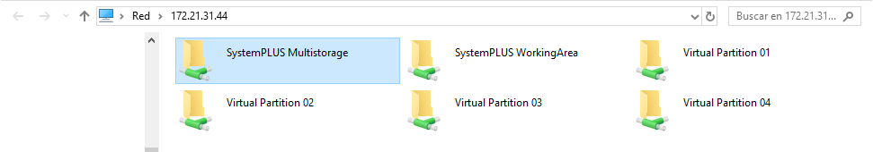

Once inside the folder, you will see a list of subfolders named `StorageYY`, where `YY` stands for a number. Inside each of these directories, you will find three items:

* A directory named `Storage Patients`.
* A `.mdb` file.
* An empty `.txt` file with the title `ZZ.txt`, where `ZZ` stands for a number.

You will know that you are in the correct `StorageYY` subfolder if your `.txt` file has the same number as the Storage number of your file of interest. In our case, the file was in storage number 79, which corresponds to the `Storage28` subfolder in `Multistorage03`.

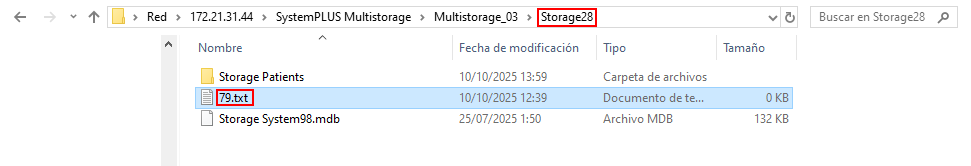

Please note that the number on the `ZZ.txt` file does not necessarily correspond to the number on the `StorageYY` subfolder. However, a higher `ZZ` number usually implies a higher `YY` number.

Enter the `Storage Patients` directory in the correct `StorageYY` subfolder. There you should be able to find the patient folder. In our case, the patient in the storage 79 had an internal patient ID of `PAT_XX223`.

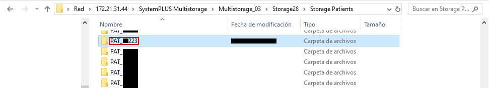

### Step 7: Search for the correct `.TRC` file with the EEG ID

Inside the patient folder, you will find both the `.TRC` files and the `.mp4` videos of that patient. To identify the correct file, use the previously obtained internal EEG ID. In the case of the patient in the WorkingArea, their EEG ID was `EEG_XXX7862`.

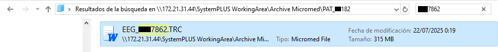

And that's it! Now you can copy the file into an external disk.